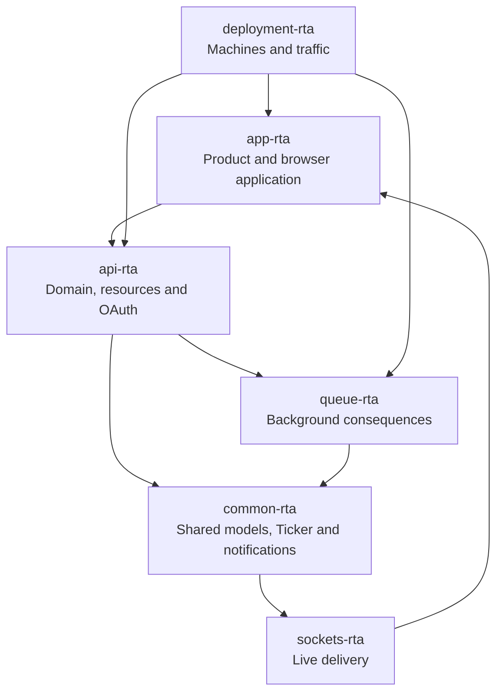

# RealtAsia

### The Right Now Real Estate

**A live social-property platform built and operated in Singapore from 2012 to 2014.**

> [!IMPORTANT]
> The public archive is being assembled now. Its six source repositories remain private while credentials, production data and personal information are removed from every reachable revision. Historical timestamps, messages, authorship and commit topology are being preserved wherever the contents permit.

## What was RealtAsia?

RealtAsia combined a professional property network, social graph and real-estate marketplace in one product.

Its surviving source contains:

- a hand-built OAuth 2 service;
- capability-driven API resources;
- polymorphic browser-side domain models;
- bidirectional likes and subscriptions;
- a materialised personal feed called Ticker;
- durable background jobs and per-recipient notifications;
- email and live Socket.IO delivery;
- property listings modelled as social objects;
- conversations, testimonials and professional profiles;
- a six-stage property-listing editor;
- chunked media ingestion, image derivation and S3 storage;
- stable avatar URLs resolved through Nginx and S3;
- salesperson attribution through short presentation and signup tokens;
- paid registration and PayPal IPN processing;
- reproducible Ubuntu provisioning and repository-driven deployment.

This was one product expressed through six repositories.

## The system

## The six repositories

| Repository | Responsibility | Public archive |
|---|---|---|
| `app-rta` | The product, hybrid PHP/JavaScript application and browser-side domain | Preparing |
| `api-rta` | OAuth, resources, permissions, interactions and product rules | Preparing |
| `common-rta` | Shared framework, domain models, Ticker and notification machinery | Preparing |
| `queue-rta` | Durable asynchronous work, feed projection and delivery processing | Preparing |
| `sockets-rta` | Narrow, disposable last-mile delivery to connected browsers | Preparing |
| `deployment-rta` | Provisioning, Nginx, S3 delivery and deployment automation | Preparing |

Each repository will include a concise README, an architecture-led technical guide and an annotated commit history. Claims in the modern commentary are tied back to the relevant historical source and commits.

## Contemporary context

The dates matter.

The OAuth implementation appears in commits from 20–22 October 2012. [RFC 6749 was published in October 2012](https://www.rfc-editor.org/info/rfc6749/).

The resource and interaction architecture was already developing before [React's first public release on 29 May 2013](https://react.dev/versions). The larger Knockout application grew during the same year that today's component-era frontend vocabulary was only beginning to form.

The archive does not retrofit modern terminology to manufacture novelty. It preserves what was built, when it was built and how its boundaries emerged under real operation.

## Start here

The guided reading order will be:

1. **`app-rta`** — the complete product and its substantial JavaScript application;
2. **`api-rta`** — the resource grammar, OAuth boundary and social interaction model;
3. **`common-rta`** — the shared domain, Ticker and notification records;
4. **`queue-rta`** — the asynchronous consequences of social activity;
5. **`sockets-rta`** — the hundred-line service that understood its job;
6. **`deployment-rta`** — the point where source code became somebody's problem at three in the morning.

Until the repositories are released, the first public technical account is [The Invisible CDN We Built in 2012 for Dynamic Avatars](https://geekist.co/the-invisible-cdn-we-built-in-2012-for-dynamic-avatars/).

## Provenance and publication

The untouched repositories remain sealed as private archival masters. Public repositories will be privacy-sanitised mirrors.

The archive preserves, in descending order of importance:

1. commit dates and messages;
2. authorship and parent relationships;
3. source structure and architectural behaviour;
4. historical defects and operational evidence;
5. the humour, panic and occasional accidental poetry of the original record.

Where personal data, credentials or third-party rights require history to change, the alteration will be recorded with its reason. See the [archive and editorial policy](https://github.com/realtasia/.github/blob/main/ARCHIVE_POLICY.md).

Modern documentation is visibly modern. Historical source is never presented as though it were written in 2026.

---

Original engineering by [Jason Nathan](https://github.com/pipewrk).

**Preserved with its timestamps, its architecture and its magnificent commit messages intact.**

